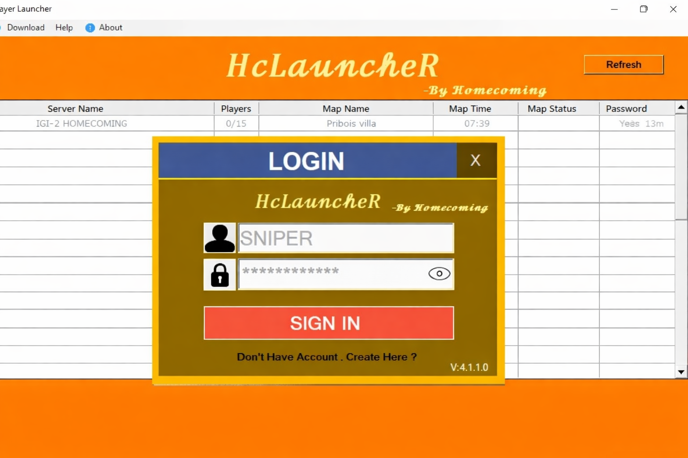

# IGI 2 Multiplayer Homecoming

## 📸 Screenshot

IGI 2 Multiplayer Homecoming is a community project that allows players to play Project IGI 2: Covert Strike in multiplayer mode using HcLauncheR.

## 🎮 Features
- Online multiplayer support
- Server hosting
- Easy connection to servers
- Supports LAN and online play
- Works on Windows 10/11

## ⚙️ Setup Guide (HcLauncheR)
Follow this step-by-step guide to set up multiplayer:

https://igi2multiplayer.pages.dev/hclauncher

## 🌐 Official Website
https://igi2multiplayer.pages.dev/

## 📌 How to Play
1. Install IGI 2: Covert Strike
2. Run HcLauncheR
3. Join or host servers
4. Start playing multiplayer

## 💡 Notes
- Run launcher as administrator if needed
- Allow through firewall
- Ensure stable internet connection

## 📢 Community
Join our Discord server to find players, get help, and play together:

https://discord.gg/tdhgXKa5Mt
